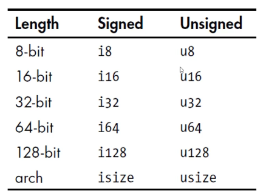
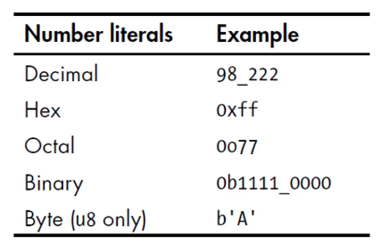

# 变量与数据类型

## 1.1 变量

### 变量与可变性

声明变量使用 `let` 关键字

默认情况下，变量是不可变的 `immutable`

声明变量时，在变量前面加上 `mut`，就可以使变量可变

```rust
let a = 1;
let mut b = 10;
b = 100;
```

### 变量与常量

常量 `constant`，常量在绑定值以后也是不可变的，但是它与不可变的变量有很多区别：

- 不可以使用 `mut`，常量永远都是不可变的

- 声明常量使用 `const` 关键字，它的类型必须被标注

- 常量可以在任何作用域内进行声明，包括全局作用域

- 常量只可以绑定到常量表达式，无法绑定到函数的调用结果或只能在运行时才能计算出的值

在程序运行期间，常量在其声明的作用域内一直有效

命名规范：Rust 里常量使用全大写字母，每个单词之间用下划线分开，例如：

```rust
const MAX_POINT:u32 = 100_000; // rust支持在数字中加入_增加可读性，MAX_POINT == 100000
```

### Shadowing（隐藏）

可以使用相同的名字声明新的变量，新的变量就会 `shadow`（隐藏）之前声明的同名变量

在后续的代码中这个变量名代表的就是新的变量

```rust
let a = 1;
let a = a + 1;
let a = a * 6;
```

`shadow` 和把变量标记为 `mut` 是不一样的:

如果不使用 `let` 关键字，那么重新给非 `mut` 的变量赋值会导致编译时错误

使用 `let` 声明的同名新变量，也是不可变的

使用 `let` 声明的同名新变量，它的类型可以与之前不同

## 1.2 数据类型

- 标量和复合类型

- Rust 是静态编译语言，在编译时必须知道所有变量的类型，基于使用的值，编译器通常能够推断出它的具体类型， 但如果可能的类型比较多（例如把 String 转为整数的 parse 方法），就必须添加类型的标注，否则编译会报错

### 标量类型

一个标量类型代表一个单个的值

Rust 有四个主要的标量类型：

- 整数类型，默认 `i32`
- 浮点类型，默认 `f64`
- 布尔类型
- 字符类型

#### 整数类型

整数类型没有小数部分

例如：`u32` 就是一个无符号的整数类型，占据 32 位的空间

无符号整数类型以 `u` 开头

有符号整数类型以 `i` 开头

Rust 的整数类型列表如图:

<div align="center"> 
    
</div>

`isize` 和 `usize` 类型的位数由程序运行的计算机的架构所决定：如果是64位计算机，那就是64位的

#### 整数字面值

<div align="center"> 
    
</div>

除了 `byte` 类型外，所有的数值字面值都允许使用类型后缀（因为byte的类型声明在前方）。例如：`57u8`

如果你不太清楚应该使用那种类型，可以使用 Rust 相应的默认类型：

- 整数的**默认类型**就是 `i32`，总体上来说速度很快，即使在64位系统中

#### 整数溢出

例如：`u8` 的范围是 0-255，如果你把一个 `u8` 变量的值设为 256，那么：

调试模式下编译：Rust会检查整数溢出，如果发生溢出，程序在运行时就会 panic

发布模式下（release）编译：Rust 不会检查可能导致 panic 的整数溢出，如果溢出发生，Rust会执行“环绕”操作：

- 256 变成 0，257 变成 1...
- 但程序不会 panic

#### 浮点类型

- Rust有两种基础的浮点类型，也就是含有小数部分的类型
    -  `f32`，32 位，单精度
    -  `f64`，64 位，双精度

- Rust 的浮点类型使用了IEEE-754 标准来表述

- `f64` 是默认类型，因为在现代 CPU 上 `f64` 和 `f32` 的速度差不多，而且精度更高

#### 布尔类型

- Rust的布尔类型也有两个值：true 和 false

- 符号是 `bool`

#### 字符类型

- Rust 语言中 `char` 类型被用来描述语言中最基础的单个字符
- 字符类型的字面值使用**单引号**
- 占用 4 字节大小
- 是 Unicode 标量值，可以表示比 ASCIl 多得多的字符内容：拼音、中日韩文、零长度空白字符、emoji 表情等。
- 但 Unicode 中并没有“字符”的概念，所以直觉上认为的字符也许与 Rust 中的概念并不相符

### 复合类型

- 复合类型可以将多个值放在一个类型里

- Rust 提供了两种基础的复合类型:元组（Tuple )、数组

#### Tuple

Tuple 可以将多个类型的多个值放在一个类型里

Tuple 的长度是固定的：一旦声明就无法改变

**创建 Tuple**

- 在小括号里，将值用逗号分开

- Tuple 中的每个位置都对应一个类型，Tuple 中各元素的类型不必相同

```rust
let tup:(i32, f64, u8) = (500, 6.4, 1); // 类型声明可以省略
println!("{}, {}, {}", tup.0, tup.1, tup.2);
```

**解构 Tuple**

```rust
let tup:(i32, f64, u8) = (500, 6.4, 1);
let (x, y, z) = tup;
```

**访问 Tuple 的元素**

在 tuple 变量使用点标记法，后接元素的索引号

#### 数组

- 数组也可以将多个值放在一个类型里

- 数组中每个元素的类型必须相同

- 数组的长度也是固定的

**声明一个数组**

在中括号里，各值用逗号分开

```rust
let a = [1, 2, 3, 4];
```

**数组的用处**

如果想让你的数据存放在 stack（栈）上而不是 heap（堆）上，或者想保证有固定数量的元素，这时使用数组更有好处

数组没有 Vector 灵活（以后再讲）

- Vector 和数组类似，它由标准库提供
- Vector 的长度可以改变

- 如果你不确定应该用数组还是 Vector，那么估计你应该用 Vector。

**数组的类型**

数组的类型以这种形式表示：[类型;长度]

```rust
let a:[i32; 5] = [1, 2, 3, 4, 5];
```

**另一种声明数组的方法**

如果数组的每个元素值都相同，那么可以在中括号里指定初始值，然后是一个“;”，最后是数组的长度

例如：`let a = [3;5];` 它就相当于：`let a = [3,3,3,3,3];`

**访问数组的元素**

数组是 Stack 上分配的单个块的内存

- 可以使用索引来访问数组的元素

```rust
let a:[i32; 5] = [1, 2, 3, 4, 5];
let first = a[0];
let second = a[1];
```

- 如果访问的索引超出了数组的范围，那么：

    - 编译会通过

    - 运行会报错（runtime 时会 panic）

        Rust 不会允许其继续访问相应地址的内存